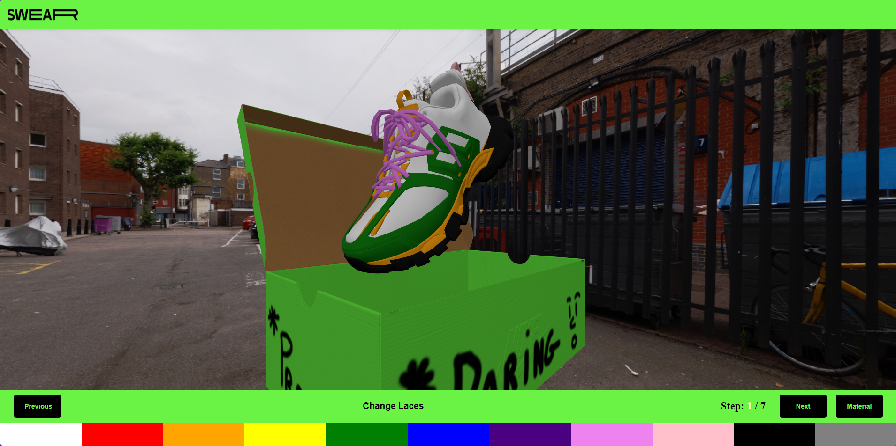

# Sneaker Configurator

Welcome to the **Sneaker Configurator** repository! 🎨👟 This project is a school assignment designed to provide a fun and interactive way to customize sneakers to your liking.

## Overview

This repository serves as a **Sneaker Configurator** where users can:  
- **Choose the color** of the sneaker.  
- **Select materials** or **add prints** to different parts of the sneaker.  
- Personalize their order by adding their **name**, **email**, **address**, and **shoe size**.  
- Once satisfied with the design, users can **place an order** seamlessly.

The project was built as an educational exercise to demonstrate interactive 3D web experiences and user interface integration.

## Features

- **Interactive 3D Design:** Customize sneakers in real-time with a responsive interface.  
- **Material and Print Selection:** Experiment with various textures and patterns.  
- **Order Form Integration:** Add personal details and finalize the order.  
- Smooth animations powered by **GSAP** for a delightful user experience.

## Tech Stack

This project utilizes the following technologies:

- **[Three.js](https://threejs.org/):** For rendering 3D models and creating a dynamic visualization experience.  
- **[Vite](https://vitejs.dev/):** A fast and modern build tool to streamline development.  
- **[Express](https://expressjs.com/):** Backend framework to handle server-side logic.  
- **[GSAP](https://greensock.com/gsap/):** For professional-grade animations and smooth transitions.

## Screenshot



> **Tip:** To replace the placeholder above, add your screenshot to the `assets` folder and update the file path accordingly.

## Installation

Follow these steps to get started:

1. Clone the repository:  
   ```bash
   git clone https://github.com/your-username/sneaker-configurator.git
   cd sneaker-configurator

2. Install dependencies:
bash
npm install

3. Start the development server:
bash
npm run dev

4. Open your browser at http://localhost:3000 to view the app.